# Agentic Meeting Intelligence & Automated Cybersecurity Incident Response System

[](https://nodejs.org/)
[](https://reactjs.org/)
[](https://groq.com/)
[](#10-evaluation-framework)

Production-style **Agentic AI System** that transforms raw meeting audio into structured business intelligence while autonomously detecting cybersecurity threats (ransomware, phishing, data exfiltration, unauthorized access) and generating automated Incident Tickets for SOC response.

Built for the **Applied AI Engineer Intern** evaluation at Monk CI.

---

## 📌 Table of Contents
1. [System Architecture](#1-system-architecture)
2. [Agent Workflow & Action Selection](#2-agent-workflow--action-selection)
3. [Available Agent Tools](#3-available-agent-tools)
4. [Explicit Shared State Management](#4-explicit-shared-state-management)
5. [Agent Observability & Tracing](#5-agent-observability--tracing)
6. [Cybersecurity Incident Response Pipeline](#6-cybersecurity-incident-response-pipeline)
7. [Error Handling & Resiliency](#7-error-handling--resiliency)
8. [Evaluation Benchmark Framework](#8-evaluation-benchmark-framework)
9. [Tech Stack](#9-tech-stack)
10. [Setup & Installation](#10-setup--installation)
11. [API Reference](#11-api-reference)

---

## 1. System Architecture

```mermaid
sequenceDiagram
    autonumber
    actor User
    participant Dashboard as React Frontend
    participant Server as Express Server
    participant Agent as Agent Orchestrator
    participant Groq as Groq AI (Whisper & Llama)
    participant SOC as SOC Alert Store

    User->>Dashboard: Upload Meeting Audio (.mp3/.wav)
    Dashboard->>Server: POST /api/meetings/upload
    Server->>Groq: Audio Transcription (whisper-large-v3)
    Groq-->>Server: Transcript Text
    Server->>Agent: runAgentWorkflow(transcript)
    
    rect rgb(20, 30, 50)
        Note over Agent: Step 1: Initialize AgentState
        Agent->>Groq: Tool: summarize_meeting
        Groq-->>Agent: Summary & Sentiment
        Agent->>Groq: Tool: extract_tasks
        Groq-->>Agent: Action Items & Execution Plan
        
        alt Security Context Detected
            Agent->>Groq: Tool: detect_security_threat
            Groq-->>Agent: Threat Breakdown (Ransomware/Phishing/Exfiltration)
            alt Confirmed Threat
                Agent->>SOC: Tool: create_incident_ticket
                SOC-->>Agent: Ticket Created (#ID)
            end
        end
    end
    
    Agent-->>Server: Final AgentState + Observability Trace
    Server-->>Dashboard: Render Real-Time Agent Workflow
```



---

## 2. Agent Workflow & Action Selection

Rather than blindly executing every step or relying on hardcoded chains, the system uses a dynamic **Agent Orchestrator** ([agentOrchestrator.js](file:///c:/Users/laksh/OneDrive/Documents/minor%20project/CyberMeet-AI/backend/services/agentOrchestrator.js)):

1. **Transcript Receipt**: Receives speech-to-text transcript output from Groq Whisper.
2. **State Initialization**: Instantiates an explicit `AgentState` object.
3. **Core Intelligence Selection**: Automatically plans and runs `summarize_meeting` and `extract_tasks`.
4. **Context-Aware Security Evaluation**:
   - Inspects transcript & summary for security indicators (breach, ransomware, exfiltration, phishing, unauthorized access, credentials).
   - If security context exists: Queues and executes `detect_security_threat`.
   - If a genuine threat is confirmed: Queues and executes `create_incident_ticket`.
   - If clean or benign: Skips ticket creation to avoid false alarms.
5. **Observability Recording**: Logs every decision point, tool execution duration, and metadata into `agentActions`.

---

## 3. Available Agent Tools

| Tool Name | Input | Output | Purpose |
| :--- | :--- | :--- | :--- |
| `summarize_meeting` | `state.transcript` | `summary`, `sentiment`, `sentimentScore` | Multi-point executive summary & sentiment analysis via Groq LLM |
| `extract_tasks` | `state.transcript` | `actionItems`, `executionPlan` | Task extraction with roles (Frontend, Backend, DevOps, QA, Security), deadlines, risks, & subtasks |
| `detect_security_threat` | `state.transcript`, `state.summary` | `securityStatus`, `securityThreat` | Hybrid LLM reasoning + rule pattern matching for cybersecurity incidents |
| `create_incident_ticket` | `state.securityThreat`, `state.title` | `incidentTicket` | Generates a high-priority SOC alert ticket in database (`Alert.js`) |

---

## 4. Explicit Shared State Management

The entire workflow passes and mutates a single deterministic state object:

```json
{
  "meetingId": "1786461739850",
  "title": "Database Security Breach Meeting",
  "transcript": "Urgent alert! Our production database server has been hacked...",
  "summary": "Production database hacked at 3 AM by ransomware...",
  "sentiment": "Negative",
  "sentimentScore": 0.1,
  "actionItems": [
    { "task": "Isolate database subnet", "assignee": "DevOps", "status": "Pending" }
  ],
  "executionPlan": [
    {
      "taskName": "Incident Exfiltration Audit",
      "description": "Verify backup integrity and restrict unauthorized SSH keys",
      "priority": "High",
      "assignedPerson": "Sarah",
      "role": "Security",
      "deadline": "2026-04-25",
      "risk": "High Risk",
      "subtasks": [{ "id": "st-1", "text": "Rotate DB credentials", "completed": false }]
    }
  ],
  "securityStatus": "Critical Threat Detected",
  "securityThreat": {
    "isSuspicious": true,
    "type": "Ransomware Attack",
    "severity": "High",
    "confidence": 0.95,
    "reason": "Ransomware note left on database server."
  },
  "incidentTicket": {
    "ticketId": "1786461739850",
    "type": "Ransomware Attack",
    "severity": "High",
    "status": "In Progress",
    "createdTime": "2026-08-11T20:42:19.850Z"
  },
  "agentActions": [
    {
      "timestamp": "2026-08-11T20:42:14.423Z",
      "type": "AGENT_PLAN",
      "message": "[Agent] Workflow started for session. State initialized."
    },
    {
      "timestamp": "2026-08-11T20:42:15.000Z",
      "type": "TOOL_COMPLETE",
      "message": "Tool: summarize_meeting completed in 577ms."
    }
  ],
  "errors": []
}
```

---

## 5. Agent Observability & Tracing

The frontend renders a dedicated **AGENT WORKFLOW & OBSERVABILITY TRACE** timeline on the Meeting Detail view ([MeetingDetail.jsx](file:///c:/Users/laksh/OneDrive/Documents/minor%20project/CyberMeet-AI/frontend/src/pages/MeetingDetail.jsx)).

Each log item displays:
- **Event Node**: Emoji indicator (🧠 Plan, ⚙️ Start, ✅ Complete, ❌ Error, 🏁 Finish)
- **Log Type**: `[AGENT_PLAN]`, `[TOOL_START]`, `[TOOL_COMPLETE]`, `[TOOL_ERROR]`
- **Timestamp**: Exact execution time
- **Metadata Chips**: Output metrics (e.g. `executionPlanCount: 2`, `duration: 1200ms`, `confidence: 0.95`)

---

## 6. Cybersecurity Incident Response Pipeline

```
Normal Meeting:      Transcript ➔ Agent ➔ summarize_meeting ➔ extract_tasks ➔ Clean State
Security Incident:   Transcript ➔ Agent ➔ summarize_meeting ➔ extract_tasks ➔ detect_security_threat ➔ create_incident_ticket ➔ SOC Ticket Alert
False Alarm Test:    Transcript ➔ Agent ➔ summarize_meeting ➔ extract_tasks ➔ detect_security_threat (Evaluates Clean) ➔ No Ticket
```

Direct integration with the **SOC Incident Dashboard** (`/soc`):
- Automatically creates SOC tickets when genuine threats are confirmed.
- Directly routes SOC engineers from Meeting Detail to Incident Resolution ([IncidentResolution.jsx](file:///c:/Users/laksh/OneDrive/Documents/minor%20project/CyberMeet-AI/frontend/src/pages/IncidentResolution.jsx)).

---

## 7. Error Handling & Resiliency

- **Empty/No Audio Input**: Gracefully completes with clear state messages rather than crashing.
- **LLM API Timeout/Failure**: Catches exceptions, records `TOOL_ERROR` steps into `agentActions`, and returns valid fallback JSON.
- **Malformed JSON Handling**: Enforces schema type conversions so arrays and strings are always validated before persisting or sending to the frontend.

---

## 8. Evaluation Benchmark Framework

Includes an automated benchmark test harness ([evaluate_agent.js](file:///c:/Users/laksh/OneDrive/Documents/minor%20project/CyberMeet-AI/backend/eval/evaluate_agent.js)) with 10 representative test scenarios in [test_dataset.json](file:///c:/Users/laksh/OneDrive/Documents/minor%20project/CyberMeet-AI/backend/eval/test_dataset.json):

```bash
# Run Evaluation Benchmark
node backend/eval/evaluate_agent.js
```

### Benchmark Results
- **Total Test Cases**: 10
- **Passed**: 10/10 (**100.0% Pass Rate**)
- **Evaluated Metrics**:
  - ✅ Structured JSON Output Schema Validity
  - ✅ Action / Tool Selection Accuracy
  - ✅ Task & Execution Plan Extraction
  - ✅ Security Threat Detection Precision
  - ✅ Incident Ticket Generation Correctness

---

## 9. Tech Stack

- **Frontend**: React 18, React Router v6, Axios, Vanilla CSS (Cyberpunk Theme)
- **Backend**: Node.js, Express.js, Multer
- **AI Models**: Groq Cloud SDK (`whisper-large-v3`, `llama-3.1-8b-instant`)
- **Persistence**: File-backed JSON store (`meetings.json`, `alerts.json`)

---

## 10. Setup & Installation

### Prerequisites
- Node.js (v18+ recommended)
- Groq API Key (`GROQ_API_KEY`)

### 1. Clone & Configure Environment
```bash
git clone https://github.com/lakshmishree36/AI-powered-smart-meeting-assistant-with-cybersecurity.git
cd CyberMeet-AI
```

Create `backend/.env`:
```env
PORT=5002
GROQ_API_KEY=your_groq_api_key_here
```

### 2. Install Dependencies & Start Services

**Backend**:
```bash
cd backend
npm install
npm start
```
*Backend runs on `http://localhost:5002`*

**Frontend**:
```bash
cd frontend
npm install
npm run dev
```
*Frontend runs on `http://localhost:5173`*

---

## 11. API Reference

| Endpoint | Method | Description |
| :--- | :--- | :--- |
| `/api/meetings/upload` | `POST` | Uploads meeting audio, triggers agent workflow in background |
| `/api/meetings` | `GET` | Fetches all meeting intelligence sessions |
| `/api/meetings/:id` | `GET` | Fetches session detail including agent state & action logs |
| `/api/meetings/:id/update-execution` | `PATCH` | Updates task execution plan status |
| `/api/alerts` | `GET` | Fetches all SOC security incident alerts |
| `/api/alerts/:id/ticket` | `PATCH` | Converts security alert to active incident ticket |